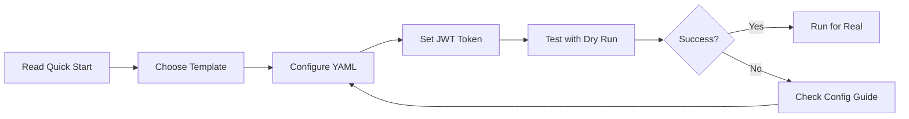
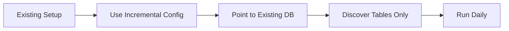

# Documentation

Complete documentation for the OpenMetadata Ingestion Library.

---

## Getting Started

1. **[Quick Start Guide](./QUICK_START.md)** - Get started in 5 minutes
   - Common scenarios with ready-to-use templates
   - Quick troubleshooting
   - Command line usage

2. **[Configuration Guide](./CONFIGURATION_GUIDE.md)** - Complete YAML configuration reference
   - Every configuration option explained
   - Source connector details
   - Discovery vs static configuration
   - 6 complete examples
   - Best practices

3. **[Entity Discovery Modes](./ENTITY_DISCOVERY_MODES.md)** - Understanding discovery patterns
   - When to use full discovery
   - When to use existing database
   - How to set up parent entities

---

## Documentation Structure

### For Users

| Document | Purpose | When to Read |
|----------|---------|--------------|
| [Quick Start](./QUICK_START.md) | Get running quickly | First time setup, need a template |
| [Configuration Guide](./CONFIGURATION_GUIDE.md) | Understand all options | Configuring advanced scenarios |
| [Entity Discovery Modes](./ENTITY_DISCOVERY_MODES.md) | Choose discovery strategy | Planning your ingestion approach |

### For Developers

| Document | Purpose | When to Read |
|----------|---------|--------------|
| [Architecture Overview](../golden-tinkering-liskov.md) | System design | Understanding the codebase |
| Source Connector Development | Build new connectors | Adding new data sources |

---

## Quick Navigation

### I want to...

**...set up ingestion for the first time**
→ Start with [Quick Start Guide](./QUICK_START.md) → Scenario 1

**...add new tables to an existing database**
→ See [Quick Start Guide](./QUICK_START.md) → Scenario 2

**...test locally with MinIO**
→ Check [Quick Start Guide](./QUICK_START.md) → Scenario 3

**...understand all configuration options**
→ Read [Configuration Guide](./CONFIGURATION_GUIDE.md)

**...filter which tables to discover**
→ See [Configuration Guide](./CONFIGURATION_GUIDE.md) → Example 3

**...use multiple environments (dev/staging/prod)**
→ See [Configuration Guide](./CONFIGURATION_GUIDE.md) → Example 4

**...manually define tables instead of discovery**
→ See [Configuration Guide](./CONFIGURATION_GUIDE.md) → Example 5

---

## Examples Directory

The `/examples` directory contains working configurations:

```
examples/
├── test_local_minio.yaml              # Full discovery (new setup)
├── test_local_minio_existing_db.yaml  # Incremental updates
├── s3_hudi_example.yaml               # AWS S3 production example
├── test_ingestion.py                  # Test runner script
└── ENTITY_DISCOVERY_MODES.md          # Discovery patterns explained
```

---

## Common Workflows

### Initial Setup Workflow



### Daily Updates Workflow



---

## Configuration Hierarchy

Understanding the YAML structure:

```yaml
metadata:           # Job identification
  name: "..."
  version: "..."

openmetadata:       # Where to send data
  host: "..."
  auth:
    jwt_token: "..."

sources:            # Where to get data (optional)
  - name: "..."
    type: "..."
    properties:
      # Source-specific

defaults:           # Default behaviors
  idempotency: "..."

entities:           # What to process (required)
  - type: "..."
    discovery:      # OR static definition
      source: "..."

audit:              # Logging (optional)
  enabled: true

execution:          # How to run (optional)
  dry_run: false
```

---

## Support & Troubleshooting

### Getting Help

1. Check [Quick Start Guide](./QUICK_START.md) → Common Issues
2. Review [Configuration Guide](./CONFIGURATION_GUIDE.md) → Troubleshooting
3. Check audit logs in `audit_logs/` directory
4. Enable debug logging: `LOG_LEVEL=DEBUG python ...`

### Debug Mode

Run with debug logging:

```bash
LOG_LEVEL=DEBUG python examples/test_ingestion.py --config your-config.yaml
```

### Common Error Messages

| Error | Quick Fix | Details |
|-------|-----------|---------|
| "JWT token is required" | `export OPENMETADATA_JWT_TOKEN="..."` | [Quick Start](./QUICK_START.md) |
| "Missing dependency: ..." | Add parent entities or use full discovery | [Entity Discovery Modes](./ENTITY_DISCOVERY_MODES.md) |
| "Failed to connect to S3" | Check credentials and endpoint | [Configuration Guide](./CONFIGURATION_GUIDE.md) |

---

## API Reference

### CLI Commands

```bash
# Run ingestion
python -m om_ingest.cli run --config <file>

# Run with dry run
python -m om_ingest.cli run --config <file> --dry-run

# Using test script
python examples/test_ingestion.py --config <file> [--dry-run]
```

### Environment Variables

| Variable | Required | Description |
|----------|----------|-------------|
| `OPENMETADATA_JWT_TOKEN` | Yes | JWT token from OpenMetadata |
| `OPENMETADATA_HOST` | No | Override host from config |
| `AWS_ACCESS_KEY_ID` | No | AWS credentials (if not in config) |
| `AWS_SECRET_ACCESS_KEY` | No | AWS credentials (if not in config) |
| `LOG_LEVEL` | No | Logging level: DEBUG, INFO, WARNING, ERROR |

---

## Version History

- **v1.0.0** (2025-11-28)
  - Initial release
  - S3 Hudi connector
  - Discovery-based ingestion
  - Static entity configuration
  - Idempotency strategies
  - Dry-run mode
  - Audit logging

---

## Contributing

See [Architecture Overview](../golden-tinkering-liskov.md) for system design and contribution guidelines.

---

## License

[Add your license here]

---

**Last Updated:** 2025-11-28
